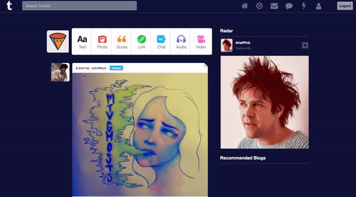
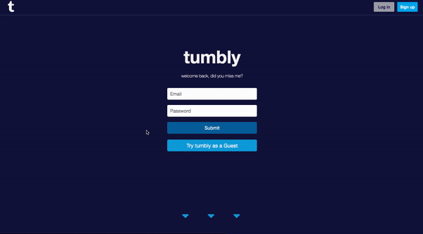
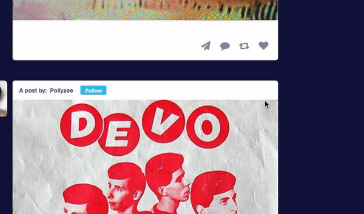
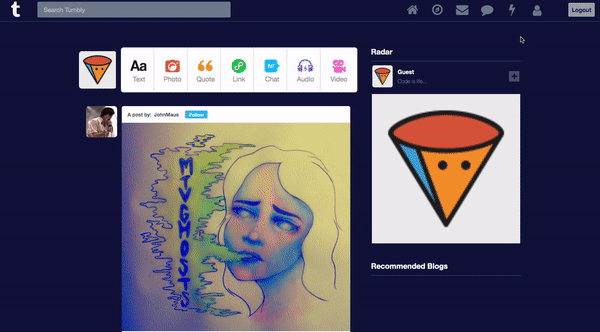

# Tumbly
## [React](https://reactjs.org/) - [Redux](https://redux.js.org/) - [JavaScript](https://www.javascript.com/) - [Ruby](https://www.ruby-lang.org/en/) - [Rails](https://rubyonrails.org/) - [AWS](https://aws.amazon.com/) - [PostgreSQL](https://www.postgresql.org/)

### Welcome to `tumbly`, my clone of the popular blogging site **Tumblr**.

## [See tumbly live](https://tumbly-app.herokuapp.com)

### This application utilizes a `Rails` backend, a Postgres database and a `React` frontend. Similarly to Tumblr, users can choose from a variety of post types to publish on their blog, like Text, Photo, Quote, etc. Your dashboard contains a feed of posts by tumbly users, and the opportunity to comment on a post (keep it friendly! :) )

------
My splash page features some nifty JavaScript event listeners and makes use of an npm package called [`react-pose`](https://github.com/Popmotion/popmotion/tree/master/packages/react-pose) to aid in a sleek and stylish introduction to the site. Give it a scroll!

------------
My goal was to recreate Tumblr's styles and features. One small but special detail I'm proud of is the hover effect on blog posts. On hover, the corners of the target post appear to 'fold' in a paper-like fashion. It felt really good to nail it.

--------
I implemented infinite-scroll using a combination of the [`kaminari`](https://github.com/kaminari/kaminari) ruby gem, and the [`react-waypoint`](https://github.com/civiccc/react-waypoint) npm package. Kaminari allows for simple pagination of fetched post data, and Waypoint is a streamlined way to fire off a paginated request when the user's scroll reaches the end of the feed.

--------

I integrated AWS storage for users' profile photos and blog post images. Tumbly users can drag, drop and preview their image before posting.

-----

## Thanks for checking out `tumbly`! 
### I look forward to building out more features and tapping into the well of limitless stylistic experience that the real Tumblr offers. (Check them out too!)